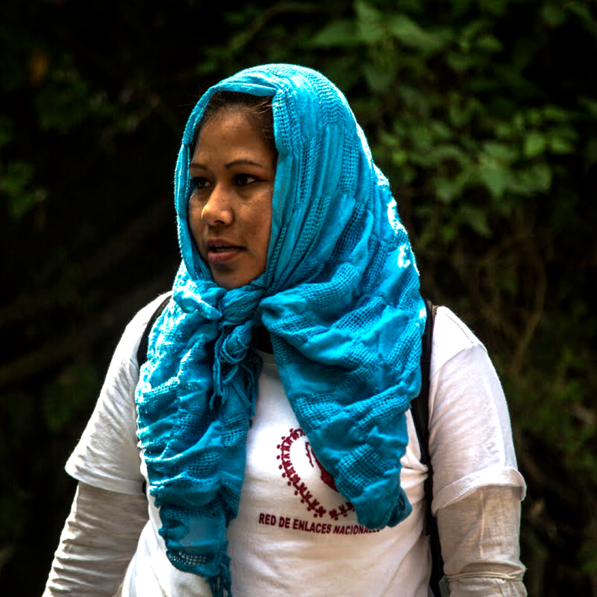
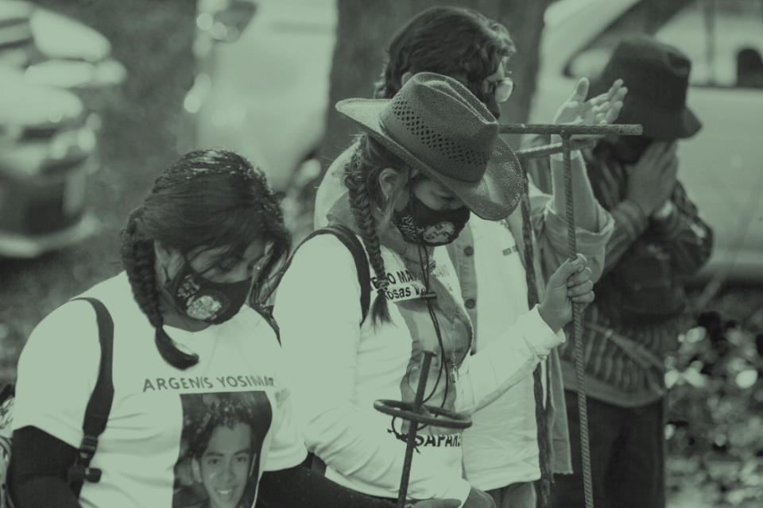
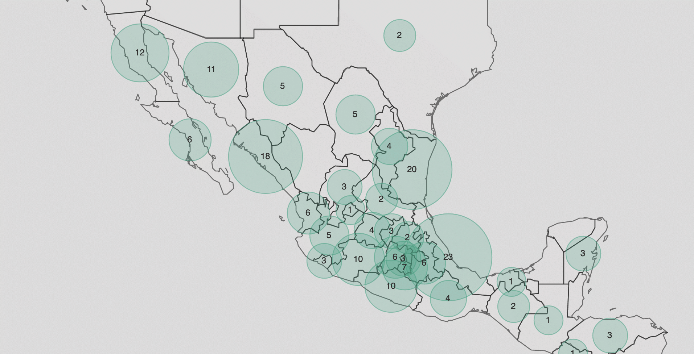
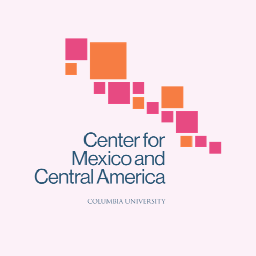

  <h2 class="page-subtitle">Información • Análisis crítico • Memoria colectiva</h2>
  

    <h1>Saberes para  la búsqueda de  personas desaparecidas en México.</h1>

    
No Están Solas es un proyecto multidisciplinario que surge en la Universidad de Columbia con el objetivo de ofrecer un conjunto de herramientas pedagógicas e informativas sobre la respuesta colectiva ante las desapariciones en México y el trabajo de búsqueda de los colectivos y familiares.

    
Buscamos brindar un espacio productivo, colaborativo y práctico para socializar información, ofrecer análisis crítico y construir memoria colectiva.

    
Finalmente, queremos responder a una necesidad apremiante de coordinación transfronteriza entre organizaciones, instituciones generadoras de conocimiento y las personas que buscan. ↓
    

  
<!-- content -->

<!-- cover -->

<!--

<ul>
<li>1</li><li>2</li><li>3</li><li>4</li><li>5</li><li>6</li><li>7</li>
</ul>

-->

<h4>“Creo que con el paso del tiempo lamentablemente te das cuenta que si no buscas tú, nadie lo va a hacer.”</h4>
<h5>– Tranquilina Hernández Lagunes.</h5>

En México, para mediados del 2022, hay +100,000 personas desaparecidas según <a href="https://versionpublicarnpdno.segob.gob.mx" target="_blank">números oficiales</a>, la mayoría de los casos se dieron desde el comienzo de la guerra contra los cárteles de las drogas en 2006. La inacción y omisión de las autoridades, el estancamiento burocrático y la impunidad han llevado a las familias a tomar el asunto en sus propias manos para buscar y lograr encontrar a sus seres queridos. 

<!-- quote content-container -->

<h4>“Uno no vive, uno sobrevive por verlos regresar o por verlos volver a casa y abrazarlos nuevamente.”</h4>
<h5>– Martha Leticia García Cruz.</h5>

Esto sucede en un contexto de violencia que no se detiene y en un país de tránsito y destino de personas en movimiento.

<!-- quote content-container -->

<h4>“Ha sido muy duro, muy duro, estar buscando y encontrar gente que dice: no busques más porque no lo encontrarás. Pero aquí estamos. No pierdo la fe y pues hasta encontrarlos a él y a todos.”</h4>
<h5>– Zuseth Adriana Heraz Amador.</h5>

<!-- quote content-container -->

<h4 class="small">“Desde el momento que yo decidí salir a las calles a buscar a mi hijo, fue a denunciar, a visibilizar por todos lados y no me he quedado callada. Es alzar la voz, gritar por todos lados, que escuchen, que se sepa lo que está pasando con las personas migrantes.”</h4>
<h5>– Ana Enamorado (Honduras).</h5>

<!-- quote content-container -->

En todo México y en países vecinos las familias han organizado colectivos, principalmente compuestos por mujeres, desarrollando métodos de búsqueda, abogando por cambios institucionales y apoyando a quienes enfrentan una desaparición, para encontrar, ya no solo a los suyos.

<h4>“Desde el primer día que yo salí a buscar a mi hijo adopté a todos los desaparecidos como si fueran uno solo.”</h4>
<h5>– Cecilia Patricia Flores Armenta.</h5>

<!-- quote content-container -->

Las buscadoras se han convertido en las principales agentes de cambio, resiliencia, experiencia y conocimiento alrededor del fenómeno de la desaparición y búsqueda en México.

<h4>“Ya tenemos más herramientas para poder buscar. Ya tenemos más herramientas para poder exigir nuestros derechos y para poder ayudar a las demás que están como nosotros.”</h4>
<h5>– Leticia Sandoval Zúñiga.</h5>

<!-- quote content-container -->

<h4 class="verysmall">“En la medida en que logremos, como familiares, concientizar a más población iremos logrando que haya más empatía y también iremos generando mayores estrategias, no solo de manera personal, sino también colectivas, para cuidarnos. Para auto-protegernos. Vamos politizándonos y eso nos da no sólo una conciencia más madura, sino una conciencia política que nos ayuda a pensar.”</h4>
<h5>– Laura María Orozco.</h5>

<!-- quote content-container -->

<!--

<h3>Saberes prácticos</h3>

  
  
    

  

  

    
7 cápsulas pedagógicas e informativas relatadas por familiares de personas desaparecidas compartiendo sus saberes sobre la desaparición y la búsqueda. Desde los primeros pasos en la desaparición; la búsqueda en sentido práctico (métodos, herramientas, la identificación) y en sentido personal (emocional y vivencial); el actuar en colectivo, la recolección de información y documentación; hasta la relación con autoridades; la seguridad y el contexto de violencia.

    <a href="{{ '/tools/' | absolute_url }}" style="margin-left:18px;">Ver cápsulas</a>
  

<!-- content-container -->

<h3 class="bg">Testimonios orales</h3>

  

    
  

  

    
60 entrevistas en 12 estados con madres, abuelas, tías, hermanas, esposas, hijas, hijos, padres y hermanos que buscan a sus seres queridos desaparecidos en México. Una compilación personal sobre el antes y el después de la desaparición, el significado de la búsqueda y la transformación del miedo en fuerza y esperanza para encontrarles.

    <a href="{{ '/testimonios/' | absolute_url }}" style="margin-left:12px;">Leer más</a>
  

<!-- /row -->

<!-- /content /archivo -->

  

    <h3>Documentos</h3>
    
Una compilación de herramientas bibliográficas y documentos sobre la búsqueda: leyes, protocolos, guías, testimonios e historias de búsqueda.
 
    <a href="{{ '/documentos/' | absolute_url }}" class="bottom">Consultar</a>
  

  

    <h3>Materiales de lectura</h3>
    
Una selección de trabajo periodístico, análisis académico, poesía, películas y proyectos multimedia, como introducción a la desaparición y la búsqueda.
 
    <a href="{{ '/recursos/' | absolute_url }}" class="bottom">Consultar</a>
  

  

    <h3>Directorio</h3>
    
Contacto de colectivos, organizaciones de sociedad civil, organismos internacionales e instituciones de gobierno, para facilitar la conexión.
 
    <a href="{{ '/directorio/' | absolute_url }}" class="bottom">Consultar</a>
  
  

<!--

  <h3>Mapas</h3>
  
Un conjunto de visualizaciones que reflejan el actuar colectivo ante la desaparición y el surgimiento del trabajo de búsqueda en México y en países a su alrededor. Un análisis de datos y narrativa con la percepción de organización colectiva y de violencia.

  

    
  

  <a href="{{ '/datavis/' | absolute_url }}">Ver Mapas</a>

<!-- /content /archivo -->

<h3>Este proyecto es posible gracias al apoyo de</h3>

  

    
    
<a href="https://brown.stanford.edu" target="_blank">Brown Institute</a>

  

  

    
    
<a href="https://library.columbia.edu" target="_blank">Columbia University</a>

  

  

    
    
<a href="https://ilas.columbia.edu/mexican-studies" target="_blank">Cemeca</a>

  

<!-- /row -->

<!-- /content /archivo -->

  
Última actualización: Septiembre, 2022.

  
Contáctanos: bridgingthesearch@gmail.com 

  
<a href="https://www.instagram.com/no_estan.solas/?igshid=YmMyMTA2M2Y=" target="_blank">Instagram</a>

  
<a href="https://www.facebook.com/Bridging-the-Search-112376501363178/about/?ref=page_internal" target="_blank">Facebook</a>

<!-- /content /archivo -->

<a href="#" id="top">↑</a>
